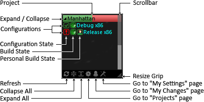
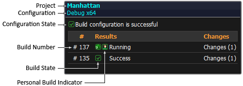

# TeamCity garget is a Windows desktop gadget for TeamCity.

This gadget receives the information about project builds from [JetBrains TeamCity](https://www.jetbrains.com/teamcity/) build management server and combine it into a compact view. Since  TeamCity Gadget uses the same information channel as JetBrains TeamCity Tray Notifier there is no need in the additional plug-ins on the server side, just install the gadget, provide the URL to TeamCity server, and it is ready to go.

TeamCity Gadget uses the same settings and notification rules as JetBrains TeamCity [Tray Notifier](https://confluence.jetbrains.com/display/TCD8/Windows+Tray+Notifier) and allows instantly evaluate the build state of the projects and the configurations you are interested in. It is always available on your sidebar if you are on Windows Vista and on your desktop in case of Windows 7. The major advantage of TeamCity Gadget is the ability to represent the project build state in compact way by colorizing background of the project name with different colors corresponding to the build configuration state.

## Layout

<div style="text-align:center">

</div>

### Configuration State Icon

The configuration state icon indicates the last build result. The icon's color is used for colorizing the part of the project's title background which corresponds to the specific configuration. All the supported configuration state icons and corresponding background colors are shown in the table below:

| Icon | Background | Description |
|:----:|:----------:|-------------|
|![success]|![background_green]|The last build completed successfully|
|![error]|![background_red]|The last build failed
|![fixing]|![background_orange]|Someone took the responsibility for the broken build
|![fixed]|![background_orange]|Someone claims that the broken build is fixed now
|![paused]|![background_blue]|The build configuration is paused
|![pending]|![background_blue]|The build configuration is pending
|![ignored]|![background_gray]|The build configuration is ignored
|![unknown]|![background_gray]|The build configuration is in unknown state

### Build State Icon
Build state icon indicates the running builds state including personal builds. If there no running builds, the build state icon is omitted. The following build state icons correspond to the three combination of the running build states:

![running_green] All builds of the configuration are running well

![running_red] All builds of the configuration are failing

![running_gray] Some builds of the configuration are running well and some are failing

### Personal Build State Icon
Personal build state icon indicates that personal build is running for the corresponding configuration. If there no running personal builds, the build state icon is omitted.

![person_green] All personal builds are running well

![person_red] All personal builds are failing

![person_gray] Some personal builds are running well and some are failing

### Flyout

It is possible to open up a flyout with additional information for the particular build configuration by clicking on Configuration State Icon, Build State Icon or Personal Build State Icon.

<div style="text-align:center">

</div>

The build state icon indicates the status of the build and can be followed by the custom build icon with correspondent color:

| Icon | Personal build icon | Description |
|:----:|:----------:|-------------|
|![success]|![person_green]| The build completed successfully
|![error]|![person_red]| The build failed
|![running_green]|![person_green]| The build is running well
|![running_red]|![person_red]| The build is failing
|![pending]|![person_blue]| The build is pending
|![ignored]|![person_blue]|	The build is canceled
|![unknown]|![person_gray]|	The build is in unknown state

[success]:/design/success.png
[error]:/design/error.png
[fixing]:/design/fixing.png
[fixed]:/design/fixed.png
[paused]:/design/paused.png
[pending]:/design/pending.png
[ignored]:/design/ignored.png
[unknown]:/design/gray.png

[background_green]:/design/background_green.png
[background_red]:/design/background_red.png
[background_orange]:/design/background_orange.png
[background_blue]:/design/background_blue.png
[background_gray]:/design/background_gray.png

[running_green]:/design/running_green.gif
[running_red]:/design/running_red.gif
[running_gray]:/design/running_gray.gif

[person_green]:/design/person_green.png
[person_red]:/design/person_red.png
[person_blue]:/design/person_blue.png
[person_gray]:/design/person_gray.png

## Dowloads
The latest versions of the gadgets can be found on [http://www.teamcity-gadget.com/](http://www.teamcity-gadget.com/)

## Build

In order to build TeamCity Gadget, you need to have [Node.js/npm](https://nodejs.org/en/download/) and [git](https://git-scm.com/downloads) installed.

Clone a copy of the main git repo by running:

```bash
git clone git://github.com/anisimovsergey/teamcity-gadget.git
```

Run the build script:
```bash
npm run build
```

The built version of TeamCity Gadget will be put in the `dist/` subdirectory.

## FAQ

### My gadget does not show anything, what am I doing wrong?

The gadget displays everything what TeamCity server sends to its tray notifier and this information depends on the notification settings. In order to modify your notification settings you need to do the following:

1. In the top right corner of the TeamCity server web page, click the arrow next to your username, and select **My Settings&Tools** from the drop-down list.
2. Open the **Notification Rules** tab.
3. Click the required notifications type: **Windows Tray Notifier**
4. For the selected notifications type, specify the notification rules, which are comprised of two parts: **what should be watched** and **notification conditions**.
5. In **To Watch** area select the builds you want to watch
6. In the notification conditions should be at least two check boxes selected **The build fails** and **The build is successful**
7. **Apply** your changes and click **Refresh** button on the gadget.
